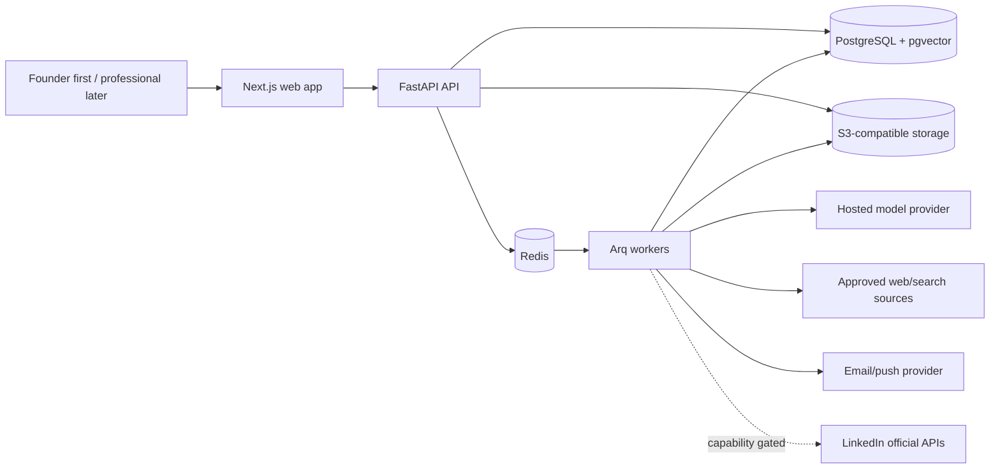
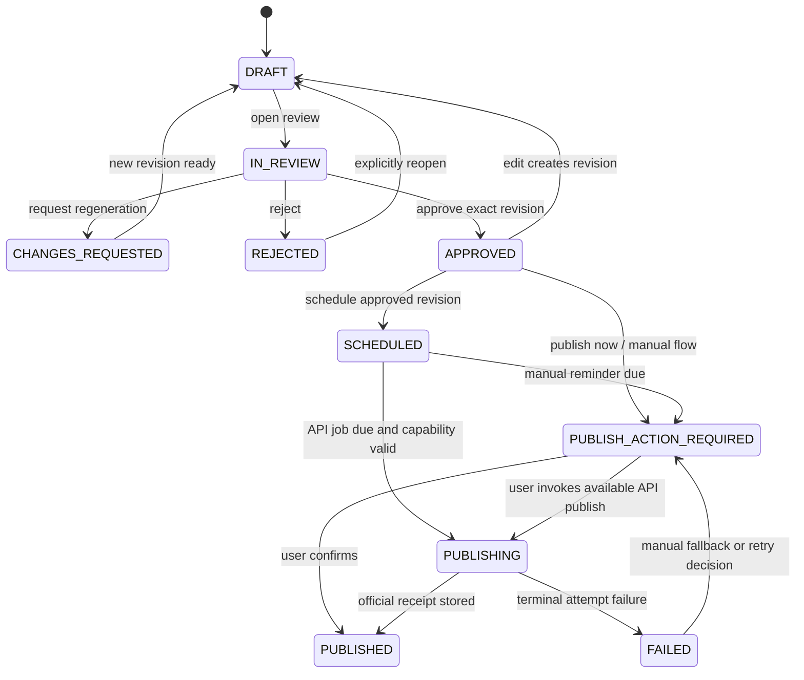

# Liproser Technical Architecture

**Status:** implementation baseline
**Related documents:** [Product plan](plan.md) · [AI agent design](agents.md)

## 1. Architecture goals

The architecture must first run as a private, single-user personal operating system without LinkedIn API approval. It must preserve mandatory human approval and explain AI outputs while retaining clean boundaries that can later be hardened for tenant isolation, managed identity, billing, and official publishing without rewriting the core content model.

### Quality attributes

| Attribute | Initial target |
|---|---|
| Availability | 99.5% monthly for web/API; reminders recover after worker outages |
| API latency | p95 under 500 ms for non-AI reads/writes |
| AI workflow latency | Profile analysis under 90 s; first draft under 45 s at p95 |
| Durability | No lost approvals, schedules, feedback, or publication receipts |
| Isolation | Every customer-owned row/object/vector is scoped by `workspace_id` |
| Recoverability | RPO ≤ 15 minutes, RTO ≤ 4 hours for production data |
| Observability | Every request, job, model call, and event shares a trace ID |

## 2. System context



No browser extension, crawler, or LinkedIn DOM integration is part of the system.

## 3. Repository and technology decisions

Use a `pnpm` monorepo for consistent tooling while keeping Python packaging independent:

```text
apps/
  web/                 Next.js, TypeScript, React, server-rendered dashboard
  api/                 FastAPI, SQLAlchemy 2, Pydantic 2, Alembic
  worker/              Arq jobs using the same Python domain packages
packages/
  contracts/           OpenAPI-generated TypeScript client and shared enums
  ui/                  Accessible design-system components
  config/              Shared lint/format/build configuration
infra/                 Container and deployment definitions
```

Decisions:

- **Frontend:** Next.js App Router, TypeScript strict mode, TanStack Query for server state, React Hook Form plus schema validation, and an accessible component foundation.
- **Backend:** FastAPI with async SQLAlchemy and Pydantic; Alembic migrations; OpenAPI is the source for generated client types.
- **Jobs:** Redis plus Arq. Jobs contain identifiers, never full private documents. Long tasks store progress in PostgreSQL.
- **Database:** PostgreSQL with pgvector. Use native row-level security as defense in depth plus mandatory application-layer workspace predicates.
- **Objects:** S3-compatible private buckets with workspace-prefixed keys, server-side encryption, short-lived signed URLs, malware scanning, and lifecycle expiration.
- **AI:** a provider adapter with structured-output validation, timeout/retry policy, model registry, and per-task routing. Domain code never imports a provider SDK directly.
- **Identity:** personal mode uses a server-side bootstrap identity bound to an explicit local/private deployment and never exposed to the public internet. Productization replaces it with an OIDC-compatible managed identity service; the API then verifies issuer, audience, signature, expiry, and membership. LinkedIn connection remains separate from login.
- **Billing:** no billing code runs in personal mode. Productization adds a Stripe-compatible boundary using checkout/customer-portal links and signed webhooks; entitlements live in Liproser and update idempotently.
- **Notifications:** provider-neutral email interface; browser/push may be added later. User time zone and quiet hours are authoritative.

## 4. Service boundaries

The initial personal deployment uses a modular monolith plus an independent worker. Modules have explicit repository/service interfaces and must not query another module's tables directly. This is a real product boundary, not a requirement to deploy separate services.

| Module | Responsibilities |
|---|---|
| Identity & Workspace | Bootstrap owner/workspace in personal mode; later users, membership, consent, and data rights |
| Profile | Imports, extraction, rubric versions, analyses, proposals, score history |
| Voice & Library | Voice samples, preference summary, taxonomy, first-party post memory, sources, embeddings, retention |
| Content | Pillars, calendars, ideas, posts, immutable revisions, claims, similarity |
| Review | Review actions, edit deltas, feedback, approval validity, audit records |
| Scheduling & Publishing | Schedules, reminders, capability checks, publish attempts/receipts |
| Analytics & Prediction | Metric snapshots, baselines, feature snapshots, predictions, calibration |
| Swipe Intelligence | Raw items, derived patterns, expiry, trend aggregation |
| AI Orchestration | Workflow runs, model calls, schemas, budgets, prompt/model versions |
| Billing & Entitlements | Usage measurement in personal mode; plans, quotas, and webhooks after productization |

## 5. Core data model

All mutable tables include `id` (UUIDv7), `workspace_id`, `created_at`, `updated_at`, and optimistic `version`. Personal mode creates one fixed owner workspace during bootstrap so personal records migrate unchanged into SaaS mode. Times are stored in UTC; user-local intent includes an IANA time-zone identifier.

| Entity | Important fields and invariants |
|---|---|
| `user` | identity subject, locale, time zone; no provider password storage |
| `workspace` / `membership` | future tenant boundary; personal bootstrap creates one `OWNER` membership |
| `consent_record` | purpose, policy version, granted/revoked time, evidence |
| `profile_import` | method, object key or pasted-content hash, extraction status, expiry |
| `profile_section` | type, confirmed text, source import, extraction confidence |
| `rubric_version` | immutable criteria and weights |
| `profile_analysis` | section scores, total score, rubric/model/prompt versions |
| `profile_suggestion` | before, after, rationale, preserved facts, proposed claims, decision |
| `voice_sample` | ownership attestation, source type, text/object reference, active flag |
| `voice_profile` | immutable version, derived preferences, prohibited patterns, embedding refs |
| `content_pillar` | name, goal, target allocation, active flag |
| `calendar` / `content_idea` | cadence window, pillar, intent, format, evidence needs, planned local time |
| `post` | stable identity and current revision pointer; status state machine |
| `post_revision` | immutable body/format, author type, voice/prompt/model versions |
| `domain` | canonical workspace-visible domain identifier, label, description, active flag |
| `tag` / `post_tag` | versioned taxonomy values and revision-level assignments with source/confidence/confirmation |
| `content_memory_entry` | eligible approved/published revision, summary/features, embedding ref, freshness, active flag |
| `claim` | text span, class, assessment, source links, acknowledgement |
| `review_action` | actor, action, revision, reason, structured feedback, timestamp |
| `edit_delta` | from/to revision, character patch, semantic summary, magnitude |
| `schedule` | approved revision, due UTC/local intent, method, state, idempotency key |
| `publish_attempt` | method, capability snapshot, request hash, response/receipt, failure code |
| `metric_snapshot` | source, observation time/window, raw counters, normalized metrics |
| `prediction` | revision, feature snapshot, model version, estimate, interval, explanations |
| `source_reference` | URL, publisher, published/retrieved times, excerpt hash, freshness |
| `swipe_item` | raw object/text reference, attribution, ownership attestation, expires at |
| `swipe_pattern` | derived categorical/numeric features; no reconstructable source text |
| `workflow_run` | agent/task, schema/prompt/model versions, status, budget, trace, error |
| `outbox_event` | aggregate/version, event name/payload, delivery status |
| `audit_event` | actor, action, target, trace, security metadata; append-only |
| `usage_ledger` | operation, measured tokens/searches/storage, entitlement period |
| `validation_journal` | task, duration, measured cost, decision/edit magnitude, outcome, usefulness note |

### Data separation and deletion

- Database access starts from authenticated membership and applies `workspace_id`; background jobs re-resolve membership/workspace rather than trusting payload claims.
- Vector metadata includes `workspace_id`; every similarity query supplies it as a mandatory filter.
- First-party memory entries reference immutable revisions. Eligibility requires `APPROVED` or `PUBLISHED`, and a revision becomes inactive immediately if approval is invalidated, the post is deleted, or the user disables memory use.
- Object keys follow `workspaces/{workspace_id}/{classification}/{uuid}` and are never derived from filenames.
- Account deletion immediately revokes tokens and access, then queues a resumable deletion manifest covering rows, objects, vectors, caches, analytics, and backups according to the published retention schedule.
- Raw third-party swipe content has `expires_at = ingested_at + 30 days` by default. A daily job deletes it and records completion; derived patterns remain selectively deletable.

## 6. Content state machine



Rules:

- Approval references one immutable `post_revision_id`. Any body, media, link, claim, or format change creates a revision and returns the post to `DRAFT`.
- Only an authenticated user action can create `APPROVED`. Agents, workers, webhooks, and administrators cannot do so.
- Scheduling requires an approved revision and an unused client idempotency key.
- The worker rechecks approval, entitlement, capability, token validity, and revision hash immediately before API publication.
- Manual confirmation stores the post URL and time when supplied; it is labelled user-confirmed, not API-verified.
- Ambiguous API timeouts are reconciled using the idempotency key/receipt lookup before retrying.

## 7. Public REST API

Use JSON under `/v1`, cursor pagination, RFC 9457 problem details, UTC RFC 3339 timestamps, and `Idempotency-Key` for mutating operations that can be retried. Every response carries `X-Request-Id`. Long-running commands return `202` with a workflow resource.

| Resource | Principal operations |
|---|---|
| `/profile-imports` | create upload/paste import, complete upload, read extraction/status |
| `/profiles/{id}/analyses` | start/read analysis and rescore |
| `/profile-suggestions/{id}/decision` | accept, edit-and-accept, or reject |
| `/voice-samples`, `/voice-profiles` | manage samples; start/read profile version build |
| `/sources` | add/approve/disable curated sources and read freshness |
| `/calendars`, `/content-ideas` | create calendars, edit slots, request ideas |
| `/posts`, `/posts/{id}/revisions` | create/read posts and immutable revisions |
| `/domains`, `/tags`, `/posts/{id}/tags` | manage taxonomy, suggest/confirm tags, and filter the private post library |
| `/content-memory/search` | retrieve eligible first-party references using domain/topic/status/freshness filters |
| `/posts/{id}/review-actions` | approve, edit-and-approve, regenerate, reject, reopen |
| `/posts/{id}/claims` | read assessments and acknowledge unresolved claims |
| `/schedules` | create, reschedule, cancel, and read delivery status |
| `/publish-attempts` | request manual/API action, confirm manual publish, read result |
| `/integrations/linkedin` | begin/callback/revoke connection and read capabilities |
| `/metric-imports`, `/posts/{id}/metrics` | CSV/manual ingestion and metric history |
| `/posts/{id}/predictions` | request/read versioned prediction and explanation |
| `/swipe-items`, `/swipe-patterns` | ingest, analyze, expire/delete, and read private patterns |
| `/workflow-runs/{id}` | status, safe error, cost/latency summary, cancellation where supported |
| `/exports`, `/account-deletion` | request/read data-rights workflows |
| `/billing`, `/entitlements`, `/usage` | checkout/portal links and current limits |

### Shared contract types

```ts
type ReviewAction = "APPROVE" | "EDIT_AND_APPROVE" | "REGENERATE" | "REJECT" | "REOPEN";

type PublishMethod = "COPY_REMINDER" | "LINKEDIN_API";

interface EditDelta {
  fromRevisionId: string;
  toRevisionId: string;
  patch: string;
  semanticSummary: string[];
  magnitude: number; // 0..1, versioned algorithm
}

interface RegenerationFeedback {
  categories: Array<"HOOK" | "TONE" | "LENGTH" | "CLAIM" | "STRUCTURE" | "CTA" | "OTHER">;
  instruction?: string;
  preserveSpans: string[];
}

interface SourceReference {
  url: string;
  publisher?: string;
  publishedAt?: string;
  retrievedAt: string;
  excerptHash: string;
  freshness: "CURRENT" | "STALE" | "UNKNOWN";
}

interface ClaimAssessment {
  claimId: string;
  classification: "OPINION" | "PERSONAL_EXPERIENCE" | "STABLE_FACT" | "QUANTITATIVE" | "TIME_SENSITIVE";
  status: "SUPPORTED" | "STALE" | "CONFLICTING" | "UNSUPPORTED" | "USER_CONFIRMED";
  confidence: number;
  sources: SourceReference[];
  explanation: string;
}

interface PredictionExplanation {
  bucket: "LOW" | "MEDIUM" | "HIGH";
  estimate?: number;
  interval?: [number, number];
  confidence: number;
  topFactors: Array<{ feature: string; direction: "UP" | "DOWN"; explanation: string }>;
  recommendedChange?: string;
  basis: "DOMAIN_PRIOR" | "BLENDED" | "PERSONALIZED";
}

interface MetricSnapshot {
  observedAt: string;
  windowHours: number;
  impressions?: number;
  reactions?: number;
  comments?: number;
  reposts?: number;
  clicks?: number;
  followers?: number;
  source: "MANUAL" | "CSV" | "LINKEDIN_API";
}

interface SwipePattern {
  hookType: string;
  structure: string;
  emotionalTriggers: string[];
  formatting: string[];
  ctaStyle?: string;
  audienceContext?: string;
  caveats: string[];
}
```

Server-side validation remains authoritative. The generated TypeScript client must not duplicate transition or entitlement rules.

## 8. Durable events and job semantics

Business writes and their `outbox_event` are committed in one database transaction. A dispatcher publishes events to Redis; consumers are at-least-once and idempotent.

| Event | Minimum payload | Consumer examples |
|---|---|---|
| `post.approved` | workspace, post, revision, actor, occurred time | scheduling UI, usage metrics |
| `post.scheduled` | schedule, approved revision, due UTC, method | scheduler |
| `publish.reminder_due` | schedule, user, reminder policy | notification worker |
| `post.published` | post, revision, method, receipt, published time | analytics baseline, reporting |
| `metrics.imported` | post, snapshot IDs, source | normalization, prediction evaluation |
| `feedback.recorded` | post/revision, action, feedback IDs | feedback synthesizer |
| `post.memory_eligible` | post, approved/published revision, confirmed tags | summary/embedding indexing |
| `post.memory_invalidated` | post, revision, reason | immediate retrieval-index removal |
| `swipe.raw_expired` | item, deletion manifest | compliance reporting |

Each handler stores `(consumer_name, event_id)` before committing effects. Retries use exponential backoff with jitter and a configured maximum. Exhausted work enters a dead-letter table with a safe replay command; user-visible workflows expose a recoverable status rather than silently failing.

## 9. AI and research runtime

The deterministic orchestrator invokes bounded agents described in [agents.md](agents.md).

### Provider interface

`ModelGateway.generate(task, messages, schema, budget, trace_context)` returns validated structured output, usage, latency, provider/model identifiers, and finish reason. It provides:

- task-based routing (`extract`, `classify`, `draft`, `critique`, `embed`);
- strict schema validation with one repair attempt;
- configurable timeouts and retry only for safe transient failures;
- per-workspace and per-plan budget enforcement;
- prompt-prefix caching where supported;
- provider policy configuration that disables training/retention where contractually available;
- a circuit breaker and a user-visible degraded mode.

Prompts and schemas are immutable versioned artifacts. Store hashes and version IDs, not raw private prompts, in general logs. Approved evaluation fixtures may retain full traces in a separately controlled environment.

### Research rules

- Search only approved public-web providers or fetch user-approved source URLs under egress controls.
- Block private/link-local IP ranges, unsafe redirects, oversized downloads, and unsupported content types.
- Treat retrieved content as untrusted data, never instructions.
- Preserve attribution metadata and hashes; quote minimally.
- A claim is not supported solely because the Writer or Research Agent says it is.

### First-party content retrieval

- Classification suggests one canonical domain and zero or more controlled topic tags. User-confirmed assignments take precedence and all changes are audited.
- Index only the user's immutable approved/published revisions; never treat rejected drafts or third-party swipe text as positive examples.
- Retrieval first filters by workspace, eligibility, domain, optional pillar/topic, and freshness, then ranks by semantic similarity and diversity.
- Return at most the configured small reference set with post/revision IDs, structural features, and concise summaries. Writer context excludes unnecessary full historical bodies.
- Save the retrieved revision IDs, taxonomy version, embedding version, scores, and filters on the workflow run for reproducibility.
- After generation, compare against retrieved references and recent posts; excessive overlap blocks readiness rather than encouraging imitation.

## 10. LinkedIn integration boundary

LinkedIn is an optional adapter with runtime capabilities such as `IDENTITY_LINKED`, `MEMBER_POST_WRITE`, `MEMBER_POST_ANALYTICS`, and `PROFILE_ANALYTICS`. Capabilities come from granted scopes plus a verified probe; UI and workers do not infer them from plan tier.

- OIDC identity data is never represented as a complete profile import.
- OAuth access/refresh tokens are envelope-encrypted with a managed KMS, never returned to the browser, and redacted from all logs.
- OAuth callback validates state, PKCE, redirect URI, issuer, and subject binding.
- Revocation or expiry removes capabilities immediately and defaults pending posts to the manual path with user notice.
- API version/header selection is configuration with expiry monitoring and contract tests.
- LinkedIn API content is tagged by provenance so storage and deletion obligations can be applied selectively.

The manual workflow remains operational regardless of integration status.

## 11. Security, privacy, and abuse controls

### Security baseline

- TLS in transit; managed encryption at rest; KMS envelope encryption for integration tokens.
- Same-site secure cookies at the web edge, CSRF protection, strict CSP, output escaping, upload scanning, and signed URLs.
- Least-privilege service identities, separate production credentials, secret rotation, dependency/SBOM scanning, and protected migrations.
- Per-user/workspace/IP rate limits, bounded uploads, decompression limits, and AI/search quotas.
- Immutable security/audit trail for consent, approvals, publishing, exports, deletion, and administrative access.
- No private content, tokens, full prompts, or source excerpts in application logs, traces, analytics, or error messages.

### Privacy controls

- Consent is purpose-specific and versioned for profile processing, AI processing, public-web research, integration access, and optional future model improvement.
- The user can inspect active voice samples/sources, reset learned preferences, export data, revoke integrations, and delete the account.
- Cross-customer aggregate learning requires separate consent, minimum cohort sizes, de-identification review, and a documented deletion strategy; it is disabled by default.
- Backups age out under a documented window; deletion receipts distinguish immediate live-data deletion from backup expiry.

### Threats requiring explicit tests

Cross-tenant IDOR, prompt injection in PDFs/web sources, malicious files, SSRF, stored XSS in previews, OAuth token theft, forged billing webhooks, replayed approvals, duplicate publishing, data extraction through embeddings, and worker payload tampering.

## 12. Deployment and operations

### Personal mode

Run the web app, API, worker, PostgreSQL/pgvector, Redis, and S3-compatible local object store through Docker Compose on a private machine or private network. Bind application ports to loopback by default, generate secrets during setup, require encrypted backups, and expose no public signup. A `PERSONAL_MODE=true` configuration is accepted only outside production and only with an explicit bootstrap owner/workspace.

Personal mode still uses migrations, immutable revisions, outbox delivery, workspace scoping, usage measurement, export/deletion, model adapters, and the same API contracts. It omits managed identity, billing, public ingress, LinkedIn OAuth, multi-user administration, and production SLO paging.

### SaaS mode

Build OCI containers for API and worker. The web application may deploy to a managed Next.js platform. A reference managed mapping is:

- managed Next.js frontend/CDN;
- managed container runtime for API and worker;
- managed PostgreSQL with pgvector, point-in-time recovery, and read replica option;
- managed Redis with persistence appropriate to job delivery;
- S3-compatible object storage and KMS;
- managed email, secrets, error monitoring, and OpenTelemetry backend.

No domain module may depend on a vendor-specific queue, object, identity, or model SDK outside its adapter.

Environments are `personal`, `local`, `preview`, `staging`, and `production`. Personal-to-SaaS migration exports the owner workspace through the normal export path and imports it through a versioned administrative migration—not ad hoc database copying. Production migrations use expand/migrate/contract steps, backward-compatible API deployment, automated backup verification, and documented rollback. Feature flags gate LinkedIn capabilities, prediction, swipe analysis, billing, and model versions.

## 13. Observability and SLOs

- **Metrics:** request/job latency and failure, queue age, workflow completion, model/search usage and cost, schema-repair rate, notification delivery, outbox lag, dead-letter count, and publication reconciliation.
- **Traces:** web request → API command → outbox event/job → agent/model/search call, joined by W3C trace context.
- **Logs:** structured, redacted, sampled, and linked to trace/workflow IDs; workspace IDs are pseudonymized in analytics views.
- **Product events:** use stable event schemas and exclude post/profile bodies.
- **Alerts:** approval bypass attempt, cross-tenant authorization denial spike, queue-age breach, deletion-job failure, cost anomaly, LinkedIn API deprecation, token decryption error, and duplicate-publish ambiguity.

## 14. Test strategy and release gates

### Automated layers

- Unit tests for rubrics, transitions, entitlements, normalization, retention, and similarity thresholds.
- Unit/property tests for taxonomy assignment, tag precedence, memory eligibility/invalidation, tenant filters, diversity ranking, and traceable retrieval.
- Property/state-machine tests proving all paths to `PUBLISHED` include an approval of the exact revision.
- Contract tests for OpenAPI clients, model JSON schemas, event versions, billing webhooks, and LinkedIn fixtures.
- Integration tests with real PostgreSQL/pgvector, Redis, object-store emulator, fake model/search providers, and a fake clock.
- End-to-end tests for profile import, voice onboarding, calendar, every review action, reminders, manual confirmation, export, and deletion.
- Security tests for tenant isolation, IDOR, SSRF, prompt injection, XSS, malicious PDFs, token redaction, and replay/idempotency.
- Load/chaos tests for queue recovery, outbox replay, provider timeout, notification outage, and ambiguous publish responses.

### AI evaluation gates

The evaluation definitions and agent-specific thresholds live in [agents.md](agents.md). No prompt/model version reaches production unless it passes the frozen regression set, safety thresholds, cost ceiling, and human review.

### Required acceptance scenarios

1. Low-confidence PDF extraction pauses for confirmation before analysis.
2. Accepting a suggestion preserves asserted facts; a new numeric claim is flagged.
3. Editing an approved revision revokes approval and blocks its schedule/publish attempt.
4. Duplicate schedule/publish requests result in one action.
5. An expired LinkedIn token changes capability and offers manual fallback.
6. Missing/conflicting sources appear in the claim panel and require acknowledgement.
7. Model/search timeout produces a retryable workflow without partial state mutation.
8. Swipe raw text expires at 30 days while its deletable derived pattern remains.
9. Account deletion removes live rows, vectors, objects, tokens, cache entries, and derived patterns.
10. Cold-start prediction is labelled `DOMAIN_PRIOR`; personalization activates only after the configured data threshold.
11. Personal mode starts with exactly one bootstrap owner/workspace, refuses public/production configuration, and runs with billing and LinkedIn OAuth disabled.
12. A personal-workspace export imports into staging SaaS mode without changing post revisions, approvals, source provenance, or metric history.
13. Approving/publishing a tagged revision makes it retrievable; editing, deleting, or disabling it removes it from future retrieval without affecting audit history.
14. Rejected drafts and raw swipe items never appear in positive first-party memory results, and every generated draft records which internal references were used.

## 15. Architecture decision records to create during implementation

- ADR-001: modular monolith and Arq rather than microservices/Celery.
- ADR-002: PostgreSQL/pgvector as relational and vector source of truth.
- ADR-003: immutable post revisions and approval-bound publishing.
- ADR-004: provider-neutral hosted AI gateway and model registry.
- ADR-005: derived-first third-party content retention.
- ADR-006: manual publishing as permanent fallback, not temporary technical debt.
- ADR-007: personal-first runtime and gated SaaS productization.

Changes to these decisions require an ADR, updated threat/data-flow review, and synchronized edits to all three planning documents.
