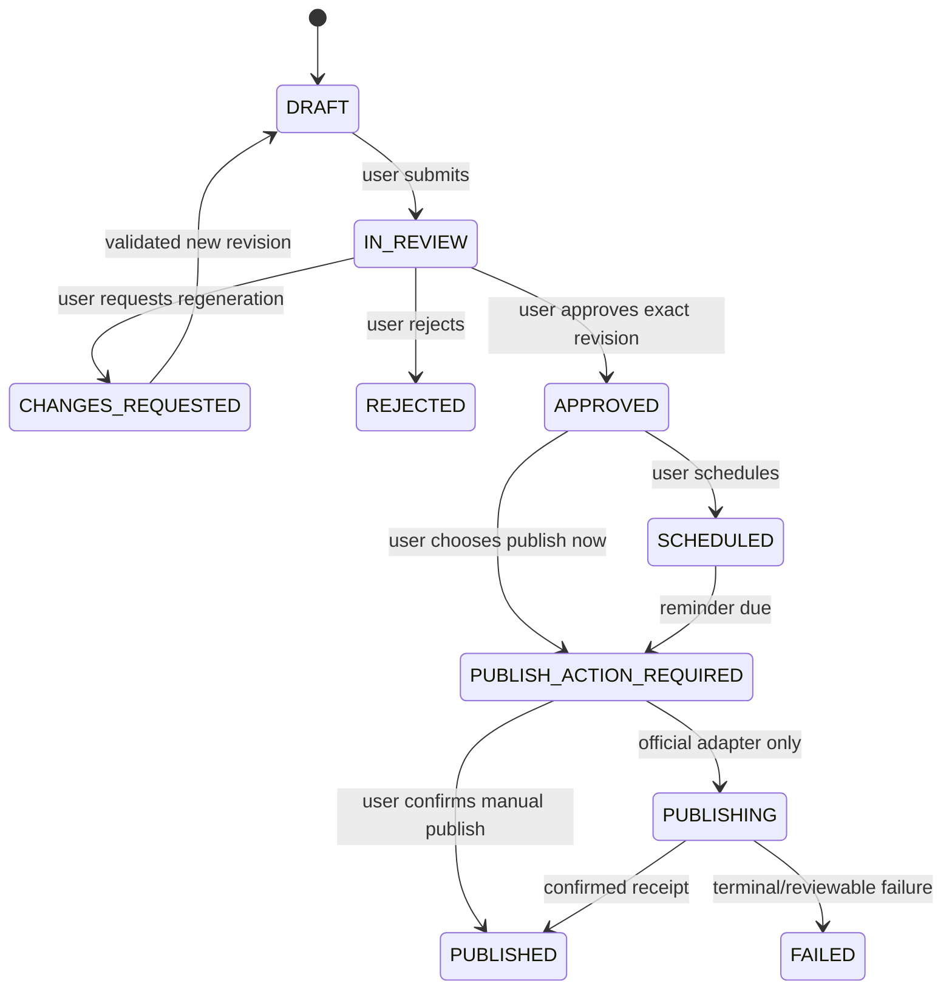

# Liproser Technical Architecture

**Status:** decision-complete personal-first baseline

**Related:** [Roadmap](ROADMAP.md) · [Product plan](plan.md) · [Runtime agents](docs/ai-agents.md) · [Repository rules](AGENTS.md)

## 1. Architectural intent

Use one modular monorepo and one PostgreSQL source of truth. The first release runs privately on the founder's Windows machine with Next.js, FastAPI, base PostgreSQL, and an adapter rooted in an ignored local directory. Infrastructure is introduced by release: pgvector in `v0.2`, Redis/Arq worker in `v0.3`, and S3-compatible managed object storage during SaaS productization.

The `/v1` namespace is the versioned application API between Liproser clients and its backend; it does not imply a public internet API. Personal mode has no application password, trusts the signed-in Windows account through a bootstrap owner/workspace, binds only to loopback, and fails closed when `APP_ENV=production` or any public bind is configured.

```mermaid
flowchart LR
    Browser[Next.js on 127.0.0.1] --> API[FastAPI application API]
    API --> DB[(PostgreSQL)]
    API --> FS[Private ignored filesystem]
    API --> AI[Model gateway]
    AI --> O[Optional Ollama]
    AI --> H[OpenAI or Claude]
    API -. v0.2 .-> V[(pgvector)]
    API -. v0.3 .-> Q[Redis and Arq worker]
    API -. approved capability .-> LI[Official LinkedIn API]
```

No LinkedIn crawler, DOM integration, browser automation, unofficial API, or third-party post ingestion exists.

## 2. Monorepo and modules

```text
apps/web/                 Next.js dashboard and generated API client
apps/api/                 FastAPI routes, composition, migrations
packages/domain/          Python entities, value objects, policies, state machines
packages/application/     Use cases, ports, authorization, outbox
packages/infrastructure/  PostgreSQL, filesystem, provider and LinkedIn adapters
workers/                  Added in v0.3 for Arq jobs
schemas/                  JSON Schema, OpenAPI, event contracts
evals/                    Synthetic/consented frozen fixtures
docs/                     ADRs, runtime-agent design, operations
```

Dependency direction is routes/adapters → application → domain. Domain code does not import web frameworks, model SDKs, Redis, filesystem, or LinkedIn clients.

## 3. Release-specific runtime

| Release | Runtime additions | Explicitly absent |
|---|---|---|
| Foundation/`v0.1` | Next.js, FastAPI, PostgreSQL, local filesystem adapter, fake/provider adapters | pgvector, Redis, worker, S3, billing, public ingress |
| `v0.2` | pgvector extension for first-party semantic retrieval | durable scheduling worker |
| `v0.3` | Redis, Arq worker, transactional outbox dispatcher, dead-letter handling | SaaS billing/public signup |
| `v0.4` | feature pipeline/model registry tables; manual/CSV analytics | automatic LinkedIn analytics unless approved |
| `SaaS MVP` | managed identity, S3 adapter, managed DB/queue, public ingress, operations | any unapproved LinkedIn capability |

Containers keep deployment portable, but personal `v0.1` should not require local replicas of future managed services.

## 4. Identity, tenancy, and authorization

Every row carries `workspace_id`; repositories require it explicitly. Personal setup creates exactly one owner and workspace. Middleware derives the actor from a loopback-only local session tied to the Windows bootstrap identity. Startup validates resolved listen addresses and rejects wildcard/non-loopback hosts, forwarded public-origin configuration, production environment, or missing bootstrap identity when `PERSONAL_MODE=true`.

SaaS mode replaces bootstrap identity with OIDC/JWT validation (issuer, audience, signature, expiry) and memberships. PostgreSQL row-level security becomes defense in depth, not a substitute for application predicates. Cache keys, object paths, events, traces, and model calls include workspace scope. Late asynchronous results re-authorize before persistence.

LinkedIn authorization is a separate encrypted connection and never application login. Tokens use envelope encryption and are excluded from logs/exports by default.

## 5. Storage and retention

The `StoragePort` supports `put`, `open`, `download_url`, `hash`, and `delete`. In personal releases its root is an explicit absolute path such as `data/private/`, validated to remain beneath the configured root and ignored by Git. SaaS swaps the adapter for a private S3-compatible bucket with workspace-prefixed keys, encryption, malware scanning, short-lived signed URLs, and lifecycle controls.

Raw profile PDFs remain until the user explicitly deletes them. Store SHA-256, media type, byte size, original display name, extraction status/confidence, creator, and timestamps. Deleting the source removes bytes and records an auditable deletion receipt while preserving confirmed extracted sections and provenance unless the user requests full profile deletion. Export/download and deletion are visible controls.

User-created relational data remains until explicit deletion or configured account policy. Temporary parser files, caches, and failed-upload quarantines have short documented TTLs. Deletion manifests cover relational rows, vectors, files/objects, caches, queued work, and OAuth tokens.

## 6. Core data model

| Aggregate/table | Key purpose |
|---|---|
| `workspace`, `actor`, `membership` | identity and ownership; one bootstrap membership initially |
| `consent_record`, `audit_log`, `deletion_manifest` | purpose/version/time evidence and lifecycle actions |
| `provider_configuration` | provider/model identifier and readiness only; never secret values |
| `ai_budget_period`, `ai_cost_reservation`, `ai_usage` | UTC month cap, reservations, actual tokens/cost, price version |
| `profile`, `profile_import`, `profile_source` | confirmed sections, `MANUAL/PDF`, file provenance/hash/state |
| `rubric`, `profile_analysis`, `profile_suggestion`, `suggestion_decision` | immutable score and rewrite history |
| `voice_profile`, `voice_preference`, `voice_sample` | versioned, inspectable style constraints from user-owned text |
| `taxonomy`, `content_idea`, `post`, `post_revision`, `post_tag` | planning, immutable content, controlled tags |
| `review`, `edit_delta`, `feedback_signal` | human decisions and reversible learning evidence |
| `source_reference`, `claim_assessment` | evidence ledger and freshness/conflict state |
| `revision_memory_eligibility`, `embedding` | first-party retrieval state/version, added in `v0.2` |
| `schedule`, `publish_attempt` | exact approved revision and manual/official delivery state |
| `metric_snapshot`, `experiment`, `feature_snapshot`, `prediction` | observation-windowed outcomes and calibrated estimates |
| `outbox_event`, `job_run`, `dead_letter` | durable async execution, added in `v0.3` |
| `linkedin_connection`, `linkedin_capability`, `sync_receipt` | optional official integration state |

Foreign keys and unique constraints enforce workspace consistency, immutable revision identity, one active approval per exact revision, idempotency keys, and metric observation windows. Sensitive searchable text is not duplicated in logs.

## 7. Content state machine



Agents and schedulers cannot create `APPROVED`. Editing creates a new immutable revision, invalidates unpublished approval/schedule eligibility, and requires review. Official publishing requires both a valid exact approval and current verified capability. Idempotency prevents duplicate attempts; ambiguity never causes an automatic retry.

## 8. Application API

All routes require server-resolved workspace scope, rate limits, request IDs, and idempotency keys on retryable mutations. Errors use a versioned problem-details schema.

### `v0.1`

| Route | Contract |
|---|---|
| `GET /v1/setup` | Return configuration/provider readiness without secrets |
| `POST /v1/setup/provider-check` | Validate selected provider/model and shared output schema |
| `POST /v1/profile-imports` | Create `MANUAL` or multipart `PDF` import |
| `GET /v1/profile-imports/{id}` | Return extraction status, confidence, provenance |
| `POST /v1/profile-imports/{id}/confirm` | Confirm/correct parsed sections |
| `DELETE /v1/profile-imports/{id}/source` | Delete retained raw source and return receipt |
| `POST /v1/profiles/{id}/analyses` | Analyze confirmed sections with pinned rubric |
| `POST /v1/profile-suggestions/{id}/decisions` | `ACCEPT`, `EDIT_AND_ACCEPT`, or `REJECT` |
| `POST /v1/profiles/{id}/rescore` | Compare against the same rubric version |
| `GET /v1/usage/ai-budget` | Actual/reserved/remaining USD and UTC reset |

### Future application resources

| Release | Resources |
|---|---|
| `v0.2A` implemented | `POST /voice-profiles`, `GET /voice-profiles/current`, `GET /taxonomy/current` |
| `v0.2B–D` | `/content-ideas`, `/posts`, `/post-revisions`, `/reviews`, `/sources`, `/claims`, `/memory/revisions` |
| `v0.3` | `/calendars`, `/schedules`, `/publish-actions`, `/feedback` |
| `v0.4` | `/metric-snapshots`, `/analytics`, `/predictions` |
| Capability gated | `/integrations/linkedin`, `/integrations/linkedin/capabilities`, `/integrations/linkedin/syncs` |
| `SaaS MVP` only | `/billing`, `/entitlements`, `/memberships`, administrative recovery |

## 9. Shared types

```typescript
type ReviewAction = "APPROVE" | "EDIT_AND_APPROVE" | "REGENERATE" | "REJECT";
type PublishMethod = "MANUAL_COPY" | "LINKEDIN_OFFICIAL_API";
type PredictionBasis = "DOMAIN_PRIOR" | "BLENDED" | "PERSONALIZED";

interface EditDelta { fromRevisionId: string; toRevisionId: string; operations: DeltaOp[]; }
interface RegenerationFeedback { categories: string[]; instruction?: string; preserveSpans: TextSpan[]; }
interface SourceReference { id: string; url: string; publisher?: string; publishedAt?: string; retrievedAt: string; contentHash: string; }
interface ClaimAssessment { claimSpan: TextSpan; kind: "CONFIRMED_PERSONAL" | "SUPPORTED" | "OPINION" | "UNSUPPORTED" | "CONFLICTING"; sourceIds: string[]; }
interface PredictionExplanation { basis: PredictionBasis; bucket: "LOW" | "MEDIUM" | "HIGH"; interval?: [number, number]; factors: Factor[]; recommendedChange?: string; limitations: string[]; }
interface MetricSnapshot { postRevisionId: string; observedAt: string; windowHours: number; impressions?: number; reactions?: number; comments?: number; reposts?: number; followerDelta?: number; clicks?: number; source: "MANUAL" | "CSV" | "LINKEDIN_OFFICIAL_API"; }
interface FirstPartyPattern { taxonomyVersion: string; supportingRevisionIds: string[]; feature: string; frequency: number; confidence: number; caveat?: string; }
```

Request/response schemas live in `schemas/`; breaking changes create a new major schema version. Workflows pin schema, prompt, rubric, model, policy, taxonomy, embedding, feature, and price versions at start.

## 10. Model gateway and budget

`AI_PROVIDER=unconfigured` is the default. First-run setup offers Ollama, OpenAI, and Claude, runs the same structured-output probe, and persists only provider/model selection. Credentials are read from the process environment or accepted by a personal-mode loopback endpoint into a process-memory session store. Session keys use masked inputs, are never returned or persisted, can be explicitly cleared, and disappear on restart. Tests use a deterministic fake provider and synthetic session keys.

- OpenAI: Responses API structured output, `store=false`, explicit output/tool ceilings, usage capture.
- Claude: Messages API with environment-based authentication and schema validation.
- Ollama: optional local chat adapter; absence is a readiness state, not startup failure before selection.

For OpenAI/Claude, begin a database transaction, lock the active UTC calendar-month budget row, price estimated maximum usage with an effective-dated table, and create a reservation only if unreserved balance covers it. After completion/failure, record actual tokens/cost and release the difference. The 80% warning uses `actual + reserved`; preflight rejects insufficient balance. Price drift and already-reserved in-flight work can produce a small final overshoot. Provider-side limits are independent. Ollama records token/latency with zero external cost. Paid search requires a different budget ledger and remains disabled.

## 11. Retrieval, evidence, and originality

The retrieval query first enforces workspace, eligibility, domain/topic, and state in SQL, then uses pgvector similarity and diversity selection in `v0.2`. Published revisions remain eligible; approved unpublished revisions require current exact approval; rejected, deleted, disabled, or superseded-unpublished revisions are excluded. Generation records selected revision IDs, taxonomy/embedding versions, and similarity scores.

Public research uses an allowlisted search provider and hardened fetcher with SSRF controls, size/time limits, content-type validation, citation metadata, and freshness. It never logs in, fetches LinkedIn, or crawls. Public source text is evidence only. Deterministic lexical/vector similarity compares drafts with eligible own posts and blocks severe reuse before the Critic explains it.

## 12. Events and jobs (`v0.3+`)

Business writes and `outbox_event` commit together. The dispatcher publishes at least once; consumers are idempotent and record attempts. Retryable failures use bounded exponential backoff and jitter; exhausted/ambiguous publication work enters dead-letter review.

Events include `post.approved`, `post.scheduled`, `publish.reminder_due`, `post.published`, `metrics.imported`, `feedback.recorded`, `voice_profile.versioned`, `data.deletion_requested`, and `linkedin.capability_changed`. Payloads contain IDs/version, not full documents. Schedules store IANA zone plus intended local time and resolved UTC instant; DST ambiguity requires explicit policy.

## 13. LinkedIn boundary

OIDC provides limited identity linking and cannot be represented as full-profile import. Automatic sync/publishing starts only after developer approval, user-granted scopes, legal/security review, encrypted-token handling, and a successful capability probe. The UI states exactly which capability is present. Full profile sections stay manual/PDF unless an official capability explicitly supplies them. Revocation immediately disables jobs and follows selective deletion policy. Every unavailable capability falls back to manual/PDF/CSV/copy workflows—never scraping.

## 14. Security, privacy, and observability

- Validate upload magic bytes/type/size, reject encrypted or malformed PDFs safely, scan before parsing, and sandbox resource use.
- Encrypt OAuth tokens and sensitive backups; TLS is mandatory outside loopback; rotate keys with versioned envelopes.
- Rate-limit by actor/workspace/task; use CSRF protection, secure cookies, CSP, output encoding, and parameterized queries.
- Redact prompts, profile text, tokens, URLs with sensitive query parameters, and file content from logs. Record IDs, hashes, versions, duration, usage, and outcomes.
- Audit approvals, schedules, publications, consent, exports, and deletions with actor/time/revision.
- Metrics include schema repair/failure, latency, budget reservation/reconciliation, claim blocks, approval/edit/reject rates, retrieval eligibility, reminder duplication, prediction calibration, and deletion completion.
- Alerts cover approval bypass attempts, public personal-mode startup, secret/token errors, cost anomalies, deletion failures, queue age, and duplicate/ambiguous publication.

## 15. Testing and acceptance

Testing layers include domain/state property tests, parser fixtures, provider contract tests, API authorization/idempotency tests, PostgreSQL integration tests, browser journeys, migration tests, and security/adversarial fixtures. Use controlled local source fixtures for citation tests; arbitrary live URL availability is not a release gate.

Mandatory scenarios:

1. Personal mode rejects production and public/wildcard binding.
2. Manual and PDF import handle uncertain, encrypted, oversized, malformed, and malicious inputs; source download/deletion is auditable.
3. Profile output is schema-valid and preserves all protected facts with zero invented critical attributes/numbers in frozen fixtures.
4. OpenAI, Claude, and Ollama adapters satisfy one schema contract when explicitly integration-tested; fake provider runs in CI.
5. Concurrent budget reservations, warning, hard rejection, reconciliation, failure, and first-of-month UTC reset pass under a fake clock.
6. Edit/regenerate/reject/approve transitions preserve exact revision authority; no agent/scheduler bypass exists.
7. Retrieval excludes ineligible/cross-workspace revisions and records all reference/version metadata.
8. Duplicate jobs and expired authorization are harmless; ambiguous publish attempts require review.
9. Metric windows/deduplication and cold-start-to-personalized blending are deterministic and labelled.
10. Export/deletion cancels pending work, removes all scoped storage classes, and rejects late results.
11. `.env`, PDFs, exports, analytics, database files, and credentials are ignored and untracked.

## 16. Deployment evolution

Personal deployment uses loopback containers/processes, PostgreSQL, and the private filesystem adapter with encrypted backups. Preview/staging/production exist only for productization and use a managed frontend, container host, PostgreSQL (with pgvector), Redis, S3-compatible object storage/KMS, managed OIDC, secret manager, and observability. Domain logic remains cloud-neutral.

Production changes use expand/migrate/contract migrations, backward-compatible API deployment, verified backups, feature flags, and rollback. External launch gates are legal review, each LinkedIn approval, model-provider data terms, privacy/security review, and deletion/incident-response readiness.
